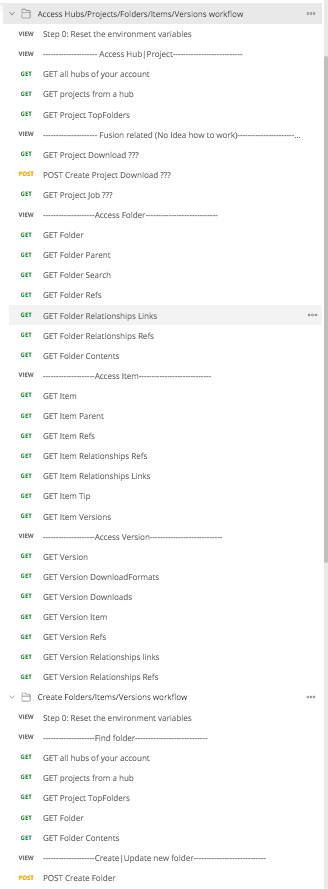
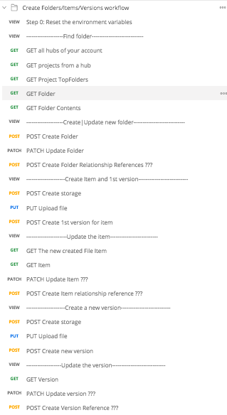
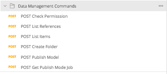

# Data Management Endpoints Setup Step-by-Step Workflow

This collection contains 3 folders, it covers all the endpoints related to Data Management SAAS endpoints, and provides the functionalities as follow:
1. Workflow to Access Hub|Project|Item|Version.
2. Workflow tp Create|Update Folder|Item|Version.
3. Data Management Commands endpoint.

# Thumbnail
- Workflow to Access Hub|Project|Item|Version.

- Workflow tp Create|Update Folder|Item|Version.

- Data Management Commands endpoint.

## License
This sample is licensed under the terms of the [MIT License](http://opensource.org/licenses/MIT). Please see the [LICENSE](LICENSE) file for full details.

## Written by
Zhong Wu [@johnonsoftware](https://twitter.com/johnonsoftware), [Forge Partner Development](http://forge.autodesk.com)
